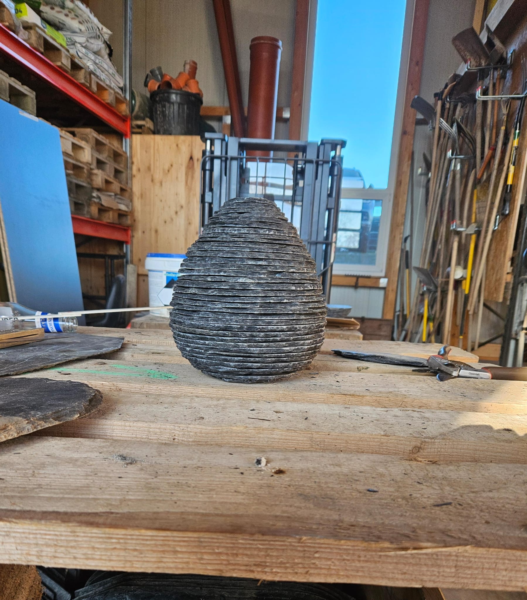

# Egg Radii Calculator

This is a simple website I created to help my brother calculate the radii of an egg shape at different heights. The tool has been very helpful for him in his rock stacking egg project—one of his many creative endeavors as a landscaper.

## How to Use

2. **Enter Egg Size:** Input the overall size of the egg.
3. **Specify Number of Floors:** Enter the number of levels you need.
4. **View Results:** The website will calculate and display the radii for each level.

## Future Enhancements

- **Additional Shapes:** Extend the calculator to include other shapes.
- **Improved Visualizations:** Enhance the graphical display of results.

## Acknowledgements

A special thank you to my brother for inspiring this project.
